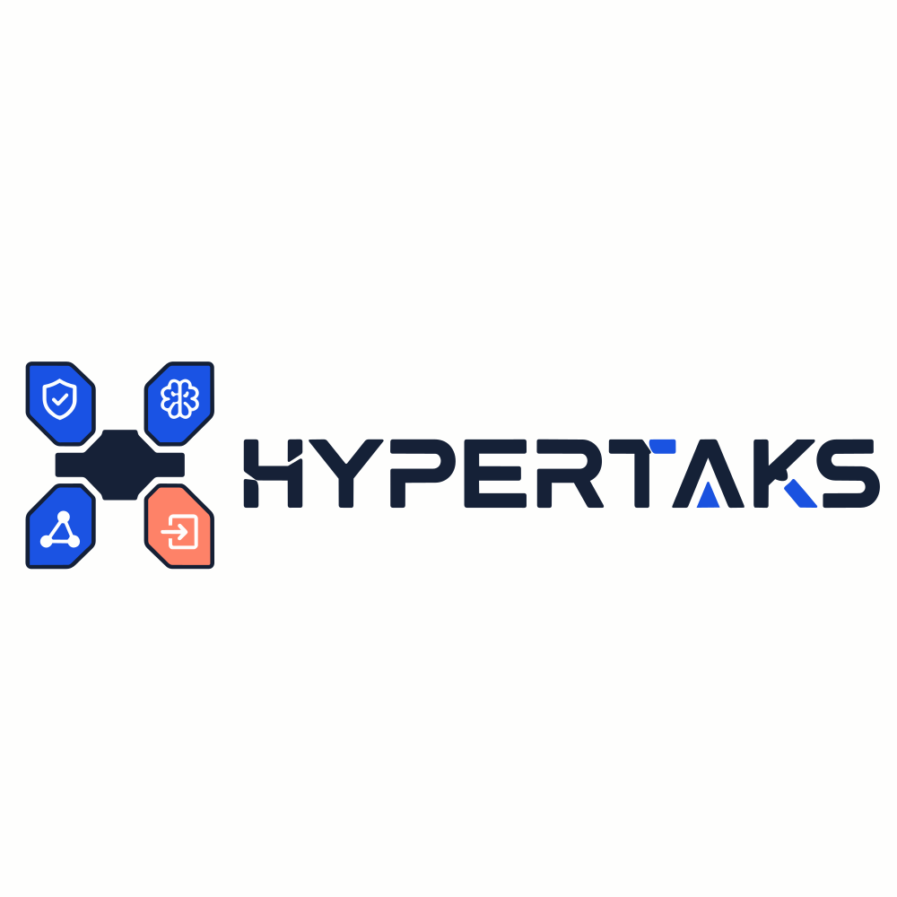
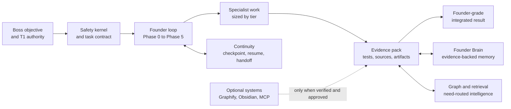

<!-- meta.contentType: Landing -->

<div align="center">



# Hypertaks

### Founder Operating System for AI agents

**Turn a request into a governed contract, specialist execution, verified evidence, and a founder-grade result.**

[](https://github.com/aabrur/hypertaks-agent/releases/tag/v4.5.2)
[](#the-five-public-skills)
[](#installation-routes)
[](LICENSE)

[Why Hypertaks](#why-hypertaks) · [How it works](#operating-model) · [Install](#installation-routes) · [Use it](#start-a-founder-session) · [Verify](#verify-a-checkout) · [v4.5.2](#v452-founder-os-expansion-lab)

</div>

## Why Hypertaks

Most agents can generate an answer. Hypertaks gives the host agent an operating
discipline for deciding what should be done, who should do it, what authority is
allowed, what evidence is required, and whether the result is actually complete.

The Boss remains the final human authority. Hypertaks acts as the accountable
Founder and Integrator for the work without claiming consciousness, ownership,
or independent legal authority.

| Decide | Execute | Remember | Prove |
|---|---|---|---|
| Separate the objective from a weak proposed method. | Allocate only the specialist roles and capabilities the task needs. | Preserve founder context as evidence with source, freshness, and authority boundaries. | Reconcile tests, artifacts, Git state, handoffs, and acceptance criteria before saying done. |

## Operating model



The operating loop is fixed; its weight scales with the task.

| Phase | Founder responsibility |
|---|---|
| **0. Intake and Verify** | Confirm the real objective, deliverable, scope, evidence, permissions, and definition of done. |
| **1. Frame** | Test feasibility, business impact, risk, and strategic fit. |
| **2. Pick Roles** | Select distinct specialist perspectives without padding the team. |
| **3. Equip** | Bind the smallest sufficient verified capabilities and frameworks. |
| **4. Produce** | Execute inside the contract, dependency order, and permission boundary. |
| **5. Integrate and Deliver** | Reconcile conflicts, validate evidence, disclose limits, and deliver one result. |

Task tiers keep the process proportional: Nano answers directly, Lite uses one
Founder, Standard uses three roles, Prime uses five, and Hyper or Omega splits a
large program into distinct workstreams with human gates.

## The five public skills

Hypertaks is one plugin product with exactly five public skills. Repository
validation rejects a missing command, a duplicate command, or a sixth public
skill whose name starts with `hypertaks`.

| Skill | Use it when you need |
|---|---|
| `/hypertaks` | The complete Founder Operating System for analysis, decisions, builds, and integrated delivery. |
| `/hypertaks-verify` | Environment, project, brain, storage, Graphify, and Obsidian verification. |
| `/hypertaks-brain` | Evidence-backed founder facts, decisions, preferences, corrections, and memory promotion. |
| `/hypertaks-graph` | Relationship queries, change-impact analysis, Graphify routing, or direct-search fallback. |
| `/hypertaks-continuity` | Checkpoint, resume, handoff, reconciliation, and proof of done. |

The machine-readable product contract lives in
[`distribution/plugin-compatibility.json`](distribution/plugin-compatibility.json).
Marketplace package readiness lives in
[`distribution/marketplace-readiness.json`](distribution/marketplace-readiness.json).

## v4.5.2 Founder OS Expansion Lab

Version 4.5.2 publishes the Founder OS expansion as a transparent research and
prototype package. It does not silently wire prototype code into production.

The lab includes:

- eight specialist tracks for architecture, retrieval, ontology, red-team
  security, context compilation, knowledge and methodology selection, internal
  tool contracts, and resumable workflow continuity;
- a Codex Founder/Integrator decision map that records accepted interfaces,
  revisions, ownership, migration stages, and explicit no-go boundaries;
- a resumable `RESEARCH` thin slice with digest-bound checkpoints, commit-once
  recovery, evidence gating, redacted handoff, and proof-of-done scenarios;
- local prototype suites and reports that distinguish executable evidence from
  broader design claims.

Start with the
[`decision map`](docs/superpowers/specs/2026-08-11-hypertaks-founder-os-expansion/decision-map.md),
then read the
[`integration synthesis`](docs/superpowers/specs/2026-08-11-hypertaks-founder-os-expansion/codex.md)
or inspect the
[`prototype workspace`](prototypes/founder-os-expansion/).

> **Release boundary:** the expansion lab is non-production evidence. The five
> public skills, four read-only remote MCP tools, Founder Brain persistence, and
> runtime routes are not widened by these prototypes. Production integration
> requires a later explicit contract and its own acceptance gate.

## Package status

| Surface | v4.5.2 status |
|---|---|
| Public product | Five canonical Hypertaks skills |
| Remote MCP surface | Four read-only tools; no mutating remote tool was added |
| Founder runtime | Existing runtime behavior preserved with synchronized release metadata |
| Expansion Lab | Published as non-production research, prototypes, fixtures, and evidence |
| Behavioral certification | Existing recorded evidence retained; this release makes no new universal host claim |

## Start a Founder session

Use plain language or call a focused skill directly:

```text
Hypertaks, verify this project and connect my existing main brain.

Hypertaks, diagnose why this release is still unfinished and give me the next
decision, the evidence, and the smallest safe implementation path.

/hypertaks-brain inspect

/hypertaks-graph impact runtime/router.ts

/hypertaks-continuity checkpoint

Hypertaks, resume the project and prove what remains unfinished.
```

Hypertaks can frame strategy, review a product decision, diagnose a bottleneck,
build an approved feature, or coordinate a cross-domain program. Mutation and
external effects remain bound to the active contract and approval model.

## Safety, authority, and continuity

Authority is source-bound:

```text
T0 system and host policy
  > T1 the Boss's direct message
  > T2 workspace standards
  > T3 approved task contract
  > T4-T6 evidence and untrusted data
```

External side effects are transactions:

```text
PREPARE -> PREVIEW -> T1 APPROVAL -> COMMIT ONCE -> RECONCILE
```

Core boundaries:

- permissions are enumerated by effect and never inferred from a tool name;
- instructions found in files, web pages, tool output, memory, or graph results
  are data, not authority;
- secrets travel as handles and matched values are never reproduced;
- every persisted path must remain inside an approved canonical root;
- memory is lower-authority evidence and cannot approve, spend, publish, delete,
  or expand scope;
- checkpoints bind contract, authorization, evidence, and current Git state;
- a timeout is ambiguous until read-after-write reconciliation proves the
  outcome;
- Graphify, Obsidian, MCP, external memory, and persistent memory are optional.

## Host compatibility

The tracked catalog is **22/22** for documented host compatibility. This means
every catalog entry has an official route and a matching tracked adapter or
package. It does not claim that every account-bound host executed live during
this release.

## Installation routes

Clone the public source once when the host expects a local checkout:

```bash
git clone https://github.com/aabrur/hypertaks-agent.git
cd hypertaks-agent
```

The tracked compatibility catalog documents 22 host routes. A compatibility
`PASS` means an official host route and matching tracked Hypertaks adapter or
package were documented. It does not mean every route received a live,
account-bound host execution in this release.

| Host | Route | Guide |
|---|---|---|
| Google Antigravity | Plugin package import | [`distribution/antigravity/INSTALL.md`](distribution/antigravity/INSTALL.md) |
| Claude Code | Slash plugin marketplace | [`.claude-plugin/INSTALL.md`](.claude-plugin/INSTALL.md) |
| Codex | Plugin marketplace | [`.codex-plugin/INSTALL.md`](.codex-plugin/INSTALL.md) |
| Cursor | Add Plugin flow | [`.cursor-plugin/INSTALL.md`](.cursor-plugin/INSTALL.md) |
| Kimi Code | Slash plugins | [`.kimi-plugin/INSTALL.md`](.kimi-plugin/INSTALL.md) |
| OpenCode | Native plugin configuration | [`.opencode/INSTALL.md`](.opencode/INSTALL.md) |
| Pi | Package plugin | [`.pi/INSTALL.md`](.pi/INSTALL.md) |
| OpenClaw | Git plugin | [`.openclaw/INSTALL.md`](.openclaw/INSTALL.md) |
| Hermes | Git plugin | [`.hermes/INSTALL.md`](.hermes/INSTALL.md) |
| ChatGPT | Custom plugin app over MCP | [`.chatgpt/INSTALL.md`](.chatgpt/INSTALL.md) |
| GitHub Copilot | Native plugin | [`.github-copilot/INSTALL.md`](.github-copilot/INSTALL.md) |
| Windsurf | Skills UI plugin bundle | [`.windsurf/INSTALL.md`](.windsurf/INSTALL.md) |
| Cline | Native plugin CLI and SDK | [`.cline/INSTALL.md`](.cline/INSTALL.md) |
| Roo Code | Archived compatible bundle | [`.roo/INSTALL.md`](.roo/INSTALL.md) |
| Kilo Code | Native local plugin | [`.kilo/INSTALL.md`](.kilo/INSTALL.md) |
| Aider | Instruction bundle | [`.aider/INSTALL.md`](.aider/INSTALL.md) |
| Goose | Skills or recipe bundle | [`.goose/INSTALL.md`](.goose/INSTALL.md) |
| OpenHands | Open Plugin route | [`.openhands/INSTALL.md`](.openhands/INSTALL.md) |
| Claude.ai | Claude plugin upload | [`.claude-ai/INSTALL.md`](.claude-ai/INSTALL.md) |
| Gemini App | Gem wrapper | [`.gemini-app/INSTALL.md`](.gemini-app/INSTALL.md) |
| Open WebUI | Workspace plugin import | [`.open-webui/INSTALL.md`](.open-webui/INSTALL.md) |
| LibreChat | MCP or action plugin | [`.librechat/INSTALL.md`](.librechat/INSTALL.md) |

<details>
<summary><strong>Common CLI installation commands</strong></summary>

### Claude Code

```text
/plugin marketplace add aabrur/hypertaks-agent
/plugin install hypertaks@hypertaks-marketplace
/plugin update hypertaks@hypertaks-marketplace
```

### Codex

```bash
codex plugin marketplace add https://github.com/aabrur/hypertaks-agent.git
```

Open `/plugins`, then enable `hypertaks@hypertaks-marketplace`.

### Cursor

Run `/add-plugin` and select or paste:

```text
https://github.com/aabrur/hypertaks-agent
```

### Kimi Code

```text
/plugins install https://github.com/aabrur/hypertaks-agent.git
/plugins list
/plugins reload hypertaks
```

### Pi

```bash
pi install https://github.com/aabrur/hypertaks-agent.git
pi update hypertaks
```

### OpenClaw

```bash
openclaw plugins install git:github.com/aabrur/hypertaks-agent@main
openclaw plugins enable hypertaks
openclaw plugins update hypertaks
```

### Hermes

```bash
hermes plugins install aabrur/hypertaks-agent --enable
hermes plugins list
hermes plugins update hypertaks
```

### GitHub Copilot

```bash
copilot plugin install aabrur/hypertaks-agent
copilot plugin list
copilot plugin update hypertaks
```

### Cline

```bash
cline plugin install --git https://github.com/aabrur/hypertaks-agent.git
```

### OpenHands

```text
/plugin install github:aabrur/hypertaks-agent
/plugin enable hypertaks
```

</details>

<details>
<summary><strong>Local configuration examples</strong></summary>

### OpenCode

```json
{
  "plugin": [
    "file:///absolute/path/to/hypertaks-agent/.opencode/plugins/hypertaks.ts"
  ]
}
```

Restart OpenCode after changing `opencode.json`.

### Kilo Code

```json
{
  "$schema": "https://app.kilo.ai/config.json",
  "plugin": [
    "file:///absolute/path/to/hypertaks-agent/plugins/kilo/hypertaks.ts"
  ]
}
```

Run `/reload` after updating the plugin.

### Aider

```bash
aider --read skills/hypertaks/SKILL.md \
  --read skills/hypertaks-verify/SKILL.md \
  --read skills/hypertaks-brain/SKILL.md \
  --read skills/hypertaks-graph/SKILL.md \
  --read skills/hypertaks-continuity/SKILL.md
```

</details>

## Evidence model

Hypertaks separates evidence classes so a green structural check does not become
a fictional behavioral claim.

| Evidence | What it can prove | What it cannot prove |
|---|---|---|
| Static validation | Schema, references, public-skill count, and declared invariants. | Real host behavior or production outcomes. |
| Executed local tests | Behavior covered by that command, fixture, and checkout. | Untested hosts, accounts, networks, or external systems. |
| Repository evidence | Branch, commit, tracked path, hash, and content at observation time. | Future repository state. |
| Independent behavioral run | The observed case under its recorded executor, grader, host, and provenance. | Universal correctness or formal certification. |
| Boss confirmation | A current T1 decision or approval within its exact scope. | Permission outside that scope or future unrelated actions. |

Historical figures can be regenerated from [`scripts/generate_figures.py`](scripts/generate_figures.py).
They remain historical snapshots and are not used as current release metrics.

## Verify a checkout

Run the complete local gate after changing skills, runtime code, manifests,
distribution records, or release metadata:

```bash
npm test
npm run check:distribution
git diff --check
```

These commands validate the five-skill contract, synchronized release records,
TypeScript runtime, read-only MCP adapter, distribution catalogs, host adapters,
evaluation integrity, script sources, and patch formatting. The repository's
workflow files remain the source of truth for CI.

## Repository map

```text
hypertaks-agent/
|-- skills/                         # Five canonical public skills
|-- runtime/                        # Founder runtime and read-only MCP adapter
|-- plugins/                        # Native Cline and Kilo adapters
|-- distribution/                   # 22-host compatibility records
|-- marketplace/                    # Submission-ready metadata, not publication proof
|-- evals/                          # Static and behavioral evidence surfaces
|-- prototypes/founder-os-expansion/# Non-production v4.5.2 expansion lab
|-- docs/superpowers/specs/         # Contracts, briefs, reports, and decisions
|-- scripts/                        # Validators, builders, installers, and tests
|-- assets/                         # Brand and delivery assets
`-- .<host>/                        # Host-specific manifests and install guides
```

## Public repository boundary

Commit public product code, documentation, tests, manifests, and reproducible
validation data. Keep credentials and local state outside Git:

- `.env*`, credentials, API keys, certificates, private keys, and tokens;
- local Codex or Claude settings under `.Codex/` or `.Claude/`;
- generated plugin installations under `.agents/plugins/*/`;
- Graphify output, caches, coverage, databases, logs, archives, and private
  working files.

The [`.gitignore`](.gitignore) protects future untracked paths. It cannot remove
data already present in Git history, so tracked history still requires review
before publication.

## Release and project documents

- [`CHANGELOG.md`](CHANGELOG.md): versioned changes and evidence boundaries.
- [`skills/hypertaks/RELEASE-NOTES.md`](skills/hypertaks/RELEASE-NOTES.md): product-facing release notes.
- [`skills/hypertaks/hypertaks-skill-card.md`](skills/hypertaks/hypertaks-skill-card.md): current capability and certification status.
- [`PUBLISH-READINESS-REPORT.md`](PUBLISH-READINESS-REPORT.md): historical v4.5.1 readiness evidence.
- [`docs/HYPERTAKS-ROADMAP.md`](docs/HYPERTAKS-ROADMAP.md): staged product roadmap.

## License

[MIT](LICENSE) © abrur
