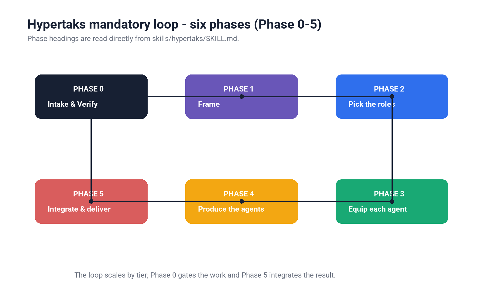
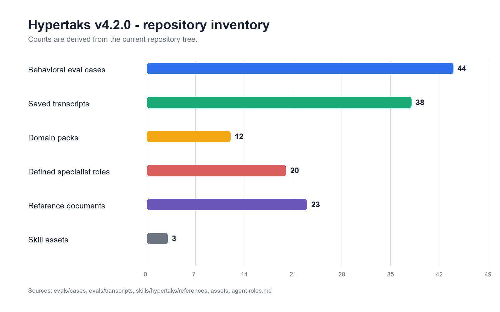
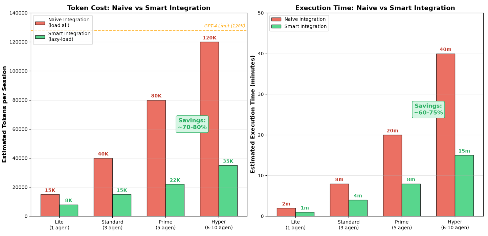
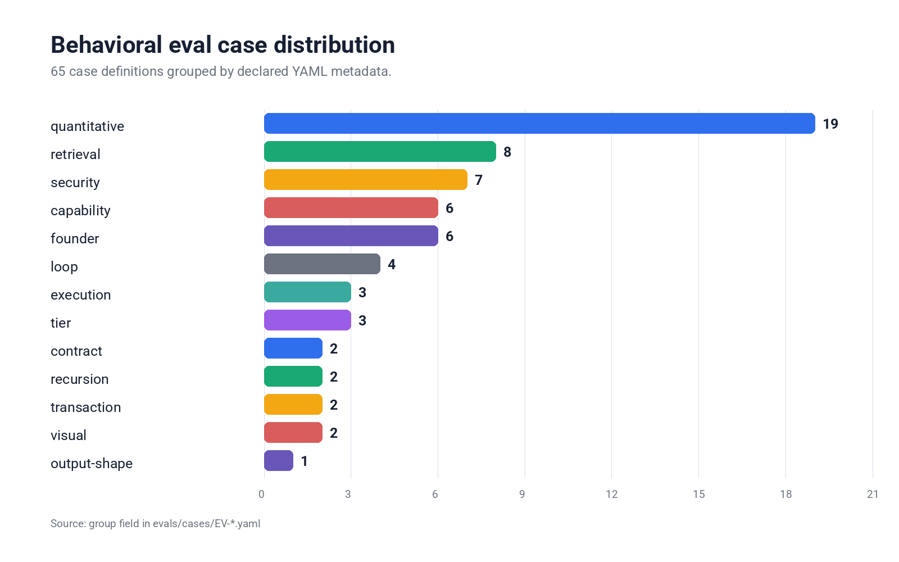

<!-- meta.contentType: Landing -->

<div align="center">

# Hypertaks

### Founder Operating System for AI agents

**One plugin product, five public skills, and 22/22 documented host routes.**

[](LICENSE)


</div>

## Read this first

Hypertaks helps an artificial intelligence (AI) agent frame work, coordinate specialist roles, preserve verified context, and prove completion. The Boss remains the final human authority. Hypertaks handles task framing, contract integrity, capability routing, evidence quality, continuity, risk disclosure, and final integration.

This README explains the product, the five public skills, supported installation routes, validation commands, and the public repository boundary.

## Product contract

Hypertaks ships as one portable plugin with exactly five public skills:

| Skill | Use it to |
|---|---|
| `/hypertaks` | Run the main Founder Operating System flow |
| `/hypertaks-verify` | Verify project, storage, memory, Graphify, and Obsidian configuration |
| `/hypertaks-brain` | Inspect and maintain evidence-backed founder memory |
| `/hypertaks-graph` | Query relationships and estimate change impact |
| `/hypertaks-continuity` | Checkpoint, resume, hand off, reconcile, and prove completion |

Repository validation rejects missing commands, duplicate commands, and a sixth public Hypertaks skill.

The machine-readable record is [`distribution/plugin-compatibility.json`](distribution/plugin-compatibility.json). Marketplace package readiness is tracked in [`distribution/marketplace-readiness.json`](distribution/marketplace-readiness.json).

## Install Hypertaks

Clone the public source once:

```bash
git clone https://github.com/aabrur/hypertaks-agent.git
cd hypertaks-agent
```

Choose the installation route for your host.

### Claude Code

```text
/plugin marketplace add aabrur/hypertaks-agent
/plugin install hypertaks@hypertaks-marketplace
/plugin update hypertaks@hypertaks-marketplace
/plugin uninstall hypertaks@hypertaks-marketplace
```

### Codex

```bash
codex plugin marketplace add https://github.com/aabrur/hypertaks-agent.git
```

Open `/plugins`, enable `hypertaks@hypertaks-marketplace`, and use the same interface to refresh or remove it.

### Cursor

Run `/add-plugin`, then select or paste the public repository path:

```text
https://github.com/aabrur/hypertaks-agent
```

Manage the plugin from Cursor Plugins.

### Kimi Code

```text
/plugins install https://github.com/aabrur/hypertaks-agent.git
/plugins list
/plugins reload hypertaks
/plugins remove hypertaks
```

### Google Antigravity

Open Antigravity Plugins, choose **Install** or **Import Plugin**, and select the Hypertaks package.

Follow the host-specific guide in [`distribution/antigravity/INSTALL.md`](distribution/antigravity/INSTALL.md).

### OpenCode

Register the local plugin in `opencode.json`:

```json
{
  "plugin": [
    "file:///absolute/path/to/hypertaks-agent/.opencode/plugins/hypertaks.ts"
  ]
}
```

Restart OpenCode after changing the plugin entry.

### Pi

```bash
pi install https://github.com/aabrur/hypertaks-agent.git
pi update hypertaks
pi remove hypertaks
```

### OpenClaw

```bash
openclaw plugins install git:github.com/aabrur/hypertaks-agent@main
openclaw plugins enable hypertaks
openclaw plugins update hypertaks
openclaw plugins uninstall hypertaks
```

### Hermes

```bash
hermes plugins install aabrur/hypertaks-agent --enable
hermes plugins list
hermes plugins update hypertaks
hermes plugins remove hypertaks
```

### GitHub Copilot

```bash
copilot plugin install aabrur/hypertaks-agent
copilot plugin list
copilot plugin update hypertaks
copilot plugin uninstall hypertaks
```

Inside Copilot CLI, use `/plugin install aabrur/hypertaks-agent` and the matching list, update, and uninstall commands.

### Windsurf

Open **Cascade → Customizations → Skills**, choose **+ Workspace** or **+ Global**, and import the five Hypertaks skill folders as one plugin bundle.

### Cline

```bash
cline plugin install --git https://github.com/aabrur/hypertaks-agent.git
cline plugin install --force --git https://github.com/aabrur/hypertaks-agent.git
```

The plugin exposes `/hypertaks <task>`. Cline integrations for VS Code and JetBrains use the same Skills import surface.

### Roo Code

Roo Code is archived. For a compatible existing environment, import the bundle into one of these skill directories:

```text
.roo/skills/
.agents/skills/
```

### Kilo Code

Register the local plugin in `kilo.json`:

```json
{
  "$schema": "https://app.kilo.ai/config.json",
  "plugin": [
    "file:///absolute/path/to/hypertaks-agent/plugins/kilo/hypertaks.ts"
  ]
}
```

Run `/reload` after updating the plugin.

### Aider

Load the five public skill entry points:

```bash
aider --read skills/hypertaks/SKILL.md \
  --read skills/hypertaks-verify/SKILL.md \
  --read skills/hypertaks-brain/SKILL.md \
  --read skills/hypertaks-graph/SKILL.md \
  --read skills/hypertaks-continuity/SKILL.md
```

You can also register the same files through `/read` or `.aider.conf.yml`.

### Goose

Install the bundle through Goose Skills Marketplace or import the reviewed Goose recipe from this repository.

### OpenHands

```text
/plugin install github:aabrur/hypertaks-agent
/plugin list
/plugin enable hypertaks
/plugin disable hypertaks
/plugin uninstall hypertaks
```

### ChatGPT

Deploy the tracked Hypertaks HTTPS Model Context Protocol (MCP) runtime. In ChatGPT, open **Plugins** or **Developer Mode**, create a custom plugin app, and connect its MCP endpoint.

Use the tracked guide in [`.chatgpt/INSTALL.md`](.chatgpt/INSTALL.md).

### Claude.ai

Open **Claude Plugins**, choose **Upload Plugin**, and upload the Hypertaks package from this repository. Replace the package to update it.

### Gemini App

Create a Gem and import the Hypertaks instruction bundle as the Gem instructions and knowledge. Replace those files to update the bundle.

### Open WebUI

Open **Admin Panel → Workspace → Tools or Functions**, then import the Hypertaks adapter. Manage the adapter from the same workspace interface.

### LibreChat

Register the Hypertaks adapter as an MCP server or OpenAPI Action in LibreChat configuration. Update or remove the corresponding entry from that configuration.


## Use the Founder Operating System

Start with plain language:

```text
Hypertaks, verify this project and connect my existing main brain.

/hypertaks-brain inspect

/hypertaks-graph impact runtime/router.ts

/hypertaks-continuity checkpoint

Hypertaks, resume the project and prove what remains unfinished.
```

You can also ask Hypertaks to fix a bug, review a product decision, build an approved feature, or explain why a release remains unfinished.

## Follow the operating loop

The Founder Operating System uses six phases:

```text
Phase 0  Intake and verify
Phase 1  Frame the objective and feasibility
Phase 2  Pick the required specialist roles
Phase 3  Equip each agent with relevant capabilities
Phase 4  Produce the work
Phase 5  Integrate, verify, and deliver
```



_The loop diagram shows the required path from intake through final delivery._

Founder memory stays evidence-backed. External actions follow this control flow:

```text
PREPARE -> PREVIEW -> T1 APPROVAL -> COMMIT ONCE -> RECONCILE
```

## Review repository evidence

The repository includes older visual evidence snapshots. They remain useful as historical context, not as current release metrics:



_Historical repository inventory snapshot from Hypertaks v4.4.0._



_Historical behavioral certification snapshot from Hypertaks v4.3.0._



_Historical distribution snapshot for 65 declared evaluation cases._

Use the current machine-readable records and validation commands for present status.

## Validate a checkout

Run the full repository checks after changing skills, runtime code, manifests, or distribution records:

```bash
npm test
npm run check:distribution
npm run test:plugin-compatibility
```

These commands check the five-skill contract, TypeScript runtime, plugin manifests, adapter paths, host compatibility, marketplace metadata, and distribution records.

## Keep the public boundary clean

Commit public product code, documentation, tests, manifests, and reproducible validation data. Keep credentials and local state outside Git:

- `.env*`, credentials, API keys, certificates, and private keys
- local Codex or Claude settings under `.Codex/` or `.Claude/`
- generated plugin installations under `.agents/plugins/*/`
- Graphify output, caches, coverage, database files, logs, archives, and private working files

The repository’s [`.gitignore`](.gitignore) protects these paths for future commits. It cannot remove data that already exists in Git history. Review tracked history before publishing any credential or private document.

## Repository layout

```text
hypertaks-agent/
├── skills/                         # Five canonical public skills
├── plugins/cline/                  # Cline native plugin
├── plugins/kilo/                   # Kilo native plugin
├── .plugin/                        # Open Plugin manifest
├── .claude-plugin/                 # Claude plugin packages
├── .codex-plugin/                  # Codex plugin package
├── .cursor-plugin/                 # Cursor plugin package
├── .kimi-plugin/                   # Kimi Code plugin package
├── .opencode/plugins/              # OpenCode plugin module
├── runtime/                        # Runtime and ChatGPT MCP adapter
├── distribution/                   # Compatibility and marketplace records
├── evals/                          # Evaluation definitions and reports
├── scripts/                        # Validators and builders
├── assets/                         # Public logo and figure assets
└── LICENSE
```

## License

[MIT](LICENSE) © abrur
