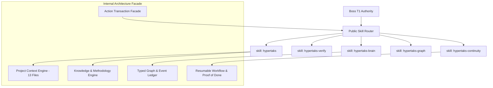

# Ticket #1 Report: Architecture Audit and Target Architecture (Claude Code)

Contract: `HT-20260811-FOS`
Agent: Claude Code
Status: PROTOTYPED
Date: 2026-08-11

## Current-State Findings

### 1. Observed Repository Baseline
Based on empirical inspection of `runtime/router.ts`, `runtime/public-skill-router.ts`, `runtime/founder-brain.ts`, `runtime/chatgpt-mcp-server.mjs`, `skills/`, `docs/HYPERTAKS-ROADMAP.md`, and existing specs/plans:

- **Public Skill Boundary**: Exactly 5 canonical public skills (`hypertaks`, `hypertaks-verify`, `hypertaks-brain`, `hypertaks-graph`, `hypertaks-continuity`) located in `skills/`.
- **Remote MCP Transport Boundary**: Exactly 4 read-only remote MCP tools (`hypertaks_manifest`, `hypertaks_get_skill`, `hypertaks_route`, `hypertaks_verify_installation`) implemented in `runtime/chatgpt-mcp-server.mjs`.
- **Runtime Components**: Router dispatch and capability classification in `runtime/router.ts` and `runtime/public-skill-router.ts`; memory management and pointer configurations in `runtime/founder-brain.ts`.
- **Knowledge Kernel**: Knowledge Routing Kernel (`K1`) established in `HYPERTAKS-ROADMAP.md`.

### 2. Documentation Path Drift
- Brief `01-claude-code.md` references `docs/superpowers/specs/2026-07-15-hypertaks-v430-relevance-router-design.md` and `docs/superpowers/specs/2026-07-22-hypertaks-v440-retrieval-execution-design.md`.
- Empirical repository inspection reveals that `2026-07-15-hypertaks-v430-relevance-router.md` is located under `docs/superpowers/plans/` and `2026-07-23-hypertaks-v440-auto-update.md` is located under `docs/superpowers/plans/`.

### 3. Existing-versus-Missing Capability Matrix

| Capability Dimension | Existing Baseline in Runtime / Skills | Target Architecture Extension | Status / Gap |
| --- | --- | --- | --- |
| Public Skill Surface | 5 Canonical Public Skills in `skills/` | Unchanged (5 Skills) | Preserved Public Boundary |
| Remote MCP Adapter | 4 Read-Only Remote Tools in `chatgpt-mcp-server.mjs` | Unchanged (4 Remote Tools) | Preserved Transport Boundary |
| Project Context | Ephemeral session context | 13-File Typed Project Operating Context | Missing Structured Context Formalism |
| Graph Ontology | Memory records in `founder-brain.ts` | Append-Only Typed Graph (Entities, Relations, Events) | Missing Typed Graph Ontology |
| Knowledge Library | Stage K1 Knowledge Routing Kernel | Modular Knowledge & Methodology Engine | Missing Lazy Domain Composition |
| Tool Facade & Transactions | Direct tool calls without transaction envelope | Action Transaction Facade (PREPARE, PREVIEW, COMMIT) | Missing Transaction Envelope |
| Workflows & Checkpoints | Checkpoint notes in memory | Resumable Workflow Checkpoints & Proof of Done | Missing Resumable Execution State |
| Founder Commands | Standard phase loop (Phase 0-5) | Resumable `RESEARCH` Thin Slice Command | Missing Resumable Founder Command |

## Assumptions

1. **Strict Boundary Invariant**: Extending internal Founder OS capabilities must NOT add a 6th public skill starting with `hypertaks` or a 5th remote MCP tool.
2. **Contract Isolation**: Execution operates under contract `HT-20260811-FOS` in EXECUTOR MODE (`hypertaks_depth: 1`).
3. **No Infrastructure Footprint Expansion**: Mandatory external databases, vector stores, embedding APIs, daemons, background services, Graphify installs, or Obsidian installs are strictly forbidden.
4. **Standalone Type Checking**: Candidate internal interfaces in `prototypes/founder-os-expansion/claude-code/` must compile cleanly with `tsc` without mutating production runtime files.

## Proposed Interfaces

The target internal architecture introduces candidate TypeScript interface families located in `prototypes/founder-os-expansion/claude-code/interfaces.ts`:

1. **Project Context & Compilation**:
   - `ProjectContextManifest`: Declares contract, 13 document IDs, and approved root.
   - `ContextDocumentHeader` & `ContextDocument`: Frontmatter schema with evidence classification (`T0` to `T6`) and lifecycle states.
   - `ContextCompilationRequest` & `ContextCompilationResult`: Bounded context compilation engine.

2. **Typed Graph Ontology**:
   - `ProjectEntity` & `ProjectRelation`: Entity and directed edge definitions.
   - `OntologyEvent`: Append-only event ledger for graph state transitions.

3. **Knowledge Library & Methodology Engine**:
   - `KnowledgeModuleManifest`: Modular knowledge definitions.
   - `MethodologySelection`: Dynamic framework selection for execution tiers (`Nano` to `Hyper`).

4. **Action Transactions**:
   - `ActionTransaction`: State-machine transaction envelope (`PREPARE` -> `PREVIEW` -> `APPROVED` -> `COMMITTED` -> `RECONCILED`).

5. **Workflows & Checkpoints**:
   - `WorkflowDefinition` & `WorkflowCheckpoint`: Resumable step execution and snapshot capsules.
   - `FounderCommand`: High-level command controller (e.g. `RESEARCH`).

6. **Continuity & Proof of Done**:
   - `ContinuationContract`: Session handoff capsule.
   - `ProofOfDoneEvidence`: Verifiable evidence binder incorporating test runs, acceptance criteria, and Git state.

### Target Architecture Diagram



## Isolated Prototype

The prototype is located in `prototypes/founder-os-expansion/claude-code/`:

```
prototypes/founder-os-expansion/claude-code/
  ├── interfaces.ts
  ├── check.ts
  └── tsconfig.json
```

- `interfaces.ts`: Defines internal candidate TypeScript interfaces importing baseline types from `runtime/router.ts` and `runtime/founder-brain.ts`.
- `check.ts`: Structural validation test script.
- `tsconfig.json`: Isolated TypeScript compiler configuration.

## Tests and Exit Codes

1. **Candidate Interface Typecheck**:
   - Command: `npx tsc --noEmit -p prototypes/founder-os-expansion/claude-code/tsconfig.json`
   - Observed Exit Code: `0`
   - Output: Passed type checking with zero errors across all 6 candidate interface families.

2. **Workspace Runtime Typecheck**:
   - Command: `npm run typecheck`
   - Observed Exit Code: `0`
   - Output: Verified production runtime type checking remains completely clean.

3. **Git Check**:
   - Command: `git diff --check`
   - Observed Exit Code: `0`
   - Output: Clean execution, no whitespace issues.

## Risks

1. **Over-Abstraction Risk**: Defining candidate interfaces that duplicate existing `founder-brain.ts` types. Mitigation: Direct import and structural extension of existing baseline interfaces.
2. **Boundary Confusion**: External developers mistaking candidate internal interfaces for public MCP tools. Mitigation: Strict encapsulation behind internal native facades.

## Second-Order Effects

1. **Unified Baseline for Wave 2**: Provides a type-checked contract baseline for Pi (#5), Kilo (#6), Command Code (#7), and Cline (#8).
2. **Backward Compatibility**: Ensures existing skill dispatch and remote MCP tools remain untouched.

## Unresolved Decisions

1. **Transaction Persistence Path**: Deciding whether `ActionTransaction` logs should land in `.agents/` or alongside `founder-brain.ts` pointer roots.
2. **Context Token Budgeting**: Setting exact token compression thresholds for the 13 context documents during compilation.

## Provenance

- **Author**: Agent Claude Code (Ticket #1)
- **Contract**: `HT-20260811-FOS`
- **Environment**: Shared coordinator checkout `C:\Users\abrur\Documents\hypertaks-agent`; Git registered no separate Claude worktree
- **Git Commit**: `f6a02bda04438fc0a3b5d764f474a360651dd78e` on `main`
- **Execution Date**: 2026-08-11

## Recommendation

1. **Approve Architecture Audit**: Accept the candidate internal architecture and candidate interface families defined in `interfaces.ts`.
2. **Pass Deliverable to Wave 2**: Supply `claude-code.md` to dependent Wave 2 tickets (Pi #5, Kilo #6, Command Code #7).
