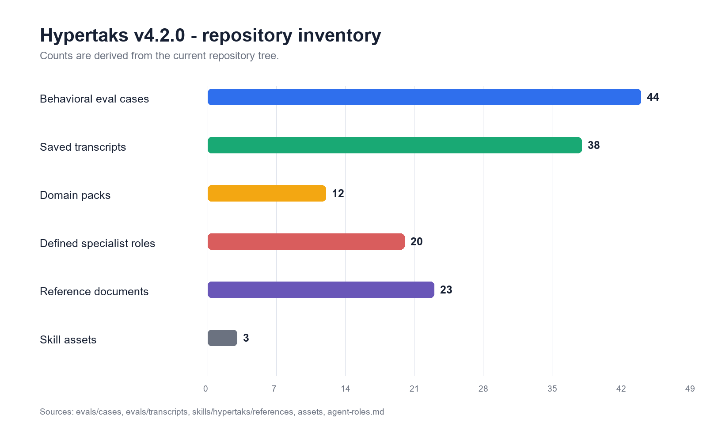
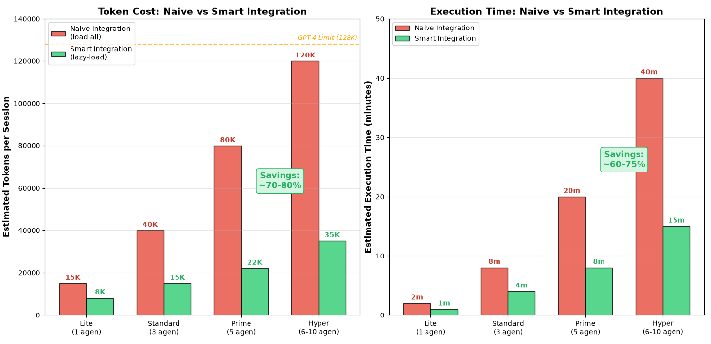
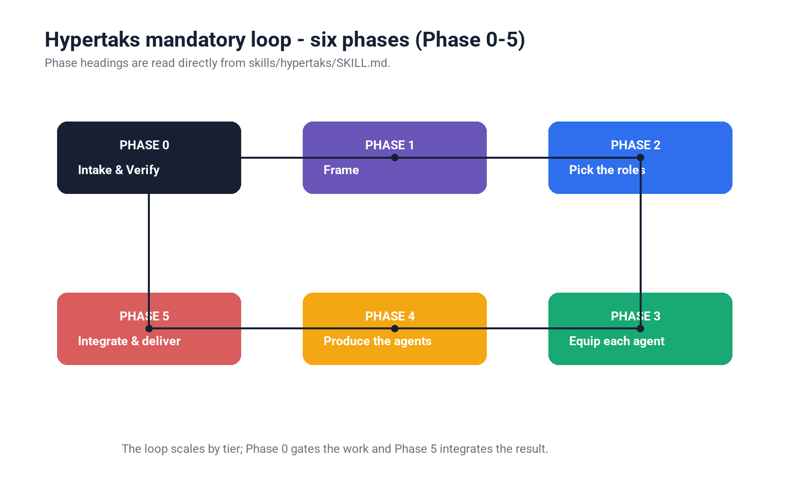
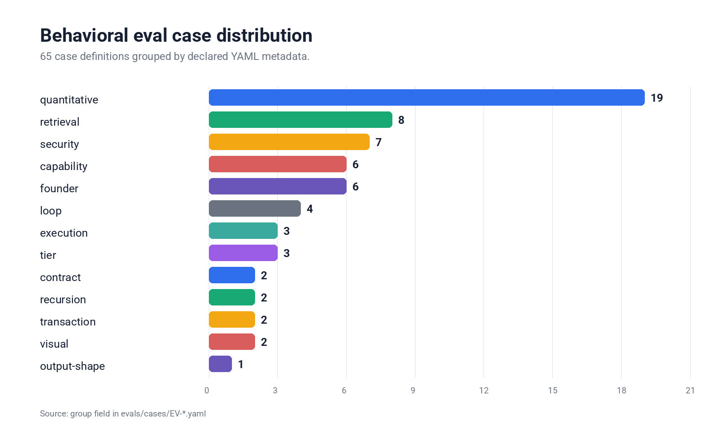

**Full Changelog**: https://github.com/aabrur/hypertaks-agent/commits/main

# Release Notes

## v4.2.0 - Safety Kernel, Deterministic Runtime, and Quantitative Domain Packs

This release adds quantitative domain references, a Safety Kernel, and explicit
runtime/provenance checks. These mechanisms improve structure and observability;
their behavioral coverage remains bounded by the evidence status below.

### 2026-07-15 audit remediation

- Hardened `scripts/run_evals.py` against mixed commit/tree/hash provenance,
  placeholder transcript fields, self-grading, and missing executor/grader
  identities.
- Cached the skill-root hash per tested commit so report validation does not
  recompute the same Git blobs for every case.
- Added regression coverage for JSONL parsing, unknown commits, tree/hash
  mismatches, placeholder responses, and self-grading.
- Extended CI with evaluator unit tests and Python compilation checks.
- The saved behavioral bundle remains legacy and invalid under the canonical
  report. No behavioral rerun was performed, `confirmed_by_boss` remains
  `false`, and v4.2.0 remains a structural release with partial behavioral
  evidence.

### Added
- **Safety Kernel (P0)**: Introduced `references/00-security-kernel.md` for absolute authority binding (T0 > T1 > T2 > T3 > T4=T5=T6) and approval-source binding to close approval spoofing.
- **State and Transactions**: Introduced `references/01-state-and-transactions.md` enforcing idempotency keys for external actions and PREPARE → PREVIEW → APPROVAL → COMMIT loop.
- **Domain Packs (Quantitative expansion)**: Added 12 routed domain packs (`D1` through `D12`) covering quantitative methods, economics, data, research, logistics, operations, trade, finance, software engineering, design/UX, engineering economy, and soft skills.
- **CORE Execution Profile**: Added the 40-line `SKILL-core.md`, a reduced profile intended for smaller context windows.
- **Behavioral Evals**: Expanded the suite to 38 case definitions, including missing-input (`DATA UNAVAILABLE`) complements.
- **Validation**: Added `scripts/run_evals.py --check` and `PyYAML` to GitHub Actions CI workflow to catch regressions early.

### Changed
- **Budget Model**: Split overhead and production budgets. Reference reading is now conditional per tier. Nano and Lite equip from memory natively and declare it.
- **Tier Scoring**: Tier assignment is now strictly deterministic based on 7 factors (Domain count, Deliverables, Reversibility, Side effects, Ambiguity, Dependency depth, Evidence required).
- **Evidence Class**: Replaced confidence percentages (pseudo-precision) with strict evidence classes: VERIFIED, INFERRED, ASSUMED, and UNKNOWN.
- **Role Interfaces**: Added 5 new specialists (Quant, Freight/Customs, Quality/Lean, Research, Asset/Maintenance) for precise routing, avoiding repetitive generic analysis.
- **Evidence Reporting**: Separated structural GREEN, saved behavioral verdicts, provenance-valid records, and Boss confirmation.

### Fixed
- Fixed recursion loop (executor mode) causing fork bombs. Subagents at `hypertaks_depth >= 1` now bypass the intake gate and compliance ceremony entirely.
- Resolved contradiction in Prime tier count rule, enforcing exactly 4 specialists + 1 Founder.
- Addressed known-deviation: Budget (W3) and Runtime (W4) commits were temporarily squashed together during integration, leading to combined tracking for conditionally-loaded reference mechanics.

### Verification boundary

- `evals/results.yaml` records 26 PASS and 12 SKIPPED(harness), all with `confirmed_by_boss: false`.
- EV-25 through EV-38 provide 14 historical PASS records with complete cold-session, tool, hash, raw-response, and independent-grader fields; they do not target the current commit.
- The canonical report is invalid for the legacy bundle. The current-HEAD provenance-valid PASS count is 0. Static GREEN and skipped cases do not count as behavioral PASS.
- This finalization does not rerun the 38-case behavioral suite.

### Repository-generated figures

---

## v4.0.0 - Binding contracts, universal tooling, knowledge-base repair

This release fixes documented structural defects, replaces a hard-coded tool
inventory with runtime categories, and removes the personal setup paths found
by the repository checks. It also defines explicit consequences for violating
the Phase 0 contract.

### Fixed (defects, stated plainly)

- **`knowledge-base.md` was broken at its core.** The FRAMEWORK section
  appeared twice under identical headers: a small English business table,
  then a much larger Indonesian table that actually held the whole catalog
  (architecture, security, ML, Web3) while labeled as business-only. The
  WORKFLOW section was one ~950-row table with the same mislabel. Dozens of
  entries were duplicated across sections, and the rows for ERC-8000 through
  ERC-10000 described standards that do not exist in the EIP registry. The
  file is now a single English catalog with 12 framework and 25 workflow
  domain subsections, no duplicate headers, no duplicate entries, and the
  fabricated rows removed.
- **The published item count was wrong.** "1,600+" counted duplicate and
  fabricated rows. The verified count after cleanup is 1,496 unique items,
  now advertised as 1,400+.
- **`plugins-and-mcp.md` was one person's tool inventory** presented as a
  general resource. It is now a function-category map (notes, design,
  scheduling, messaging, storage, browsing/testing, code hosting,
  spreadsheets, documents, media, data execution, deployment, secrets,
  on-chain execution) with a runtime binding procedure and a stated fallback
  per category. No named product is required anywhere.
- **Personal filesystem paths were hardwired** into SKILL.md and the
  deliverable template (a Windows user profile and a private vault). Logging
  is now conditional: follow the workspace's own standards file if one
  exists, otherwise log inline. No default path, no default file name.
- **Version numbers leaked into reference titles and body text.** They now
  appear only in README.md, RELEASE-NOTES.md, the skill card, and the JSON
  manifest `version` fields, and the validator enforces that.
- **Token budgets and confidence thresholds looked measured but were not.**
  They are now labeled as what they are: order-of-magnitude working
  heuristics and judgment lines, with a note to prefer real counts where a
  harness exposes them.

### Added

- **Binding task contract.** Phase 0 ends in one structured block: objective
  and definition of done, scope and exclusions, tier + gate + agent count,
  token budget target, estimated effort, explicit access permissions,
  frameworks with promised output shapes per role, measurable success
  criteria (now required as a one-liner on Lite/Standard too), and
  assumptions with alternative interpretations. It activates only on an
  explicitly affirmative reply; silence never counts.
- **Violation rollback.** Wrong tier, skipped phase, shapeless framework,
  scope drift, budget blow-through, or ungranted access triggers a fixed
  response: stop, roll back to the last clean phase boundary, name the
  violation, re-present the adjusted contract, resume only on new approval.
  Delivery is bound to the contracted success criteria for analysis and
  content tasks as well as code.
- **Mandatory trigger check** - doubt about whether the skill applies must be
  stated in one line, never resolved silently.
- **Dependency-declared waves** - each agent brief declares what it depends
  on; independent agents are produced in the same wave, dependents wait
  (orchestrated Hyper/Omega; sets writing order in synthesized mode).
- **Minimalism ladder** - before any Phase 4 artifact: does it need to exist,
  can an existing asset be reused, is there a standard solution - in that
  order, before anything custom.
- **Conditional visual capability** - Phase 0 scans whether the environment
  can render charts or generate images; if yes, the gate asks whether numeric
  or process findings should ship as visuals; if no, the topic is skipped
  entirely.
- **Validator regression checks** - Indonesian-language residue, personal
  absolute paths, version numbers outside the allowed files, and duplicate
  knowledge-base headers now fail CI. These remain structural checks; they
  still cannot test runtime behavior, and the script says so.

### Notes

- Versions bumped in lockstep across all manifests, package.json, the
  marketplace record, the README badge, and the skill card.
- The six-phase loop (Phase 0–5), tier sizes, and gate modes are unchanged; what changed is
  that deviating from them now has a defined, mandatory consequence.

---

## v3.0.0 - Karpathy discipline, TDD/verify gates, token discipline

Behavioral upgrade, not a workflow rewrite. The six-phase loop (Phase 0–5) and tiered
allocation are unchanged; v3.0 layers founder-grade engineering hygiene and
token economics on top.

### Highlights

- **Karpathy behavioral DNA baked in** - read-before-write, surgical changes
  (every changed line traces to the request), simplicity-first, and fail-loud
  on confusion. Encoded concisely in `SKILL.md` so it applies on every tier.
- **Engineering quality gate formalized** - `engineering.md` now carries the
  explicit **TDD RED-GREEN-REFACTOR** loop, the **systematic-debugging
  4-phase** protocol, **verification-before-completion**, and a **4-layer
  validation** stack. Build tasks fail loud until each gate clears; Web3
  additionally passes the on-chain audit checklist.
- **Per-tier token budgets** - new `references/token-discipline.md` defines
  budget envelopes per tier, waste patterns (wholesale reference loading,
  re-reading cached files, framework name-dropping), and a recovery protocol
  that fails loud instead of silently cutting scope.
- **Two new endpoints: Nano & Omega** - `intake-protocol.md` tier signals now
  cover **Nano** (sub-Lite, single-line confirmation, solo Founder) and
  **Omega** (beyond-Hyper, program-level). The tier table gains a
  **token-budget column**.
- **Superpowers phase-map** - new `references/superpowers-map.md` names the
  specialized skill each phase leans on (karpathy-guidelines, tdd,
  systematic-debugging, verification-before-completion), so equipped agents
  route to the right discipline at the right time.
- **Enhanced compliance footer** - the deliverable template now closes with
  **token accounting** and the **4 validation layers**, not just the tier/
  references/output-shape self-check.
- **Validation script** - `scripts/validate_skill.py` checks the structural
  invariants (frontmatter parses, every referenced file exists, all manifest
  versions agree, JSON parses). This is the executable analog of `/tdd` +
  `/verify` for a docs skill, wired to run in CI.
- **Red flags v3.0** - new anti-rationalization rows for "I'll just load the
  whole KB to be safe", "the budget can slip this once", and "I can skip
  verification, it obviously works".

### Notes

- Versions bumped in lockstep across all 7 manifests (Claude, Codex, Cursor,
  Kimi, OpenCode, Pi, cross-agent catalog) + the skill card.
- No change to the six-phase loop (Phase 0–5), the gate modes, or the existing four tier
  sizes - only additions around them.
- Deferred (honest scope): physical 9-way split of `knowledge-base.md` and a
  runtime cache/cost-routing model - these are harness-level concerns a
  markdown skill cannot genuinely deliver. Captured as candidates for a
  separate verified task.

---

## v2.0.0 - Extended knowledge base

Adds the **Encyclopedia of Applied Knowledge** as
`references/knowledge-base.md` - a catalog originally advertised as 1,600+ items;
the current verified catalog is described conservatively as 1,400+ theories, methods,
frameworks, and workflows across business, learning, science, and technology
(JTBD, Kano, RICE, Cynefin, OKR, PESTLE, DDD, MLOps, distributed-systems
consistency models, EIP standards, sales methodologies, mental models, and
far more).

- **Lazy-loaded by design** - the catalog is grepped by keyword/domain in
  Phase 3 instead of being loaded whole.
- **Same output-shape law** - items pulled from the catalog must define the
  shape their application returns, just like the core frameworks.
- **Integrator lens** - Phase 5 reconciliation now explicitly uses Systems
  Thinking + Cynefin (coherent, blind-spot-free, executable).
- **Retrospective** - Prime/Hyper deliverables close with a 2–3 line
  post-run retrospective (continuous improvement loop).
- Note: the catalog's item names are English; some annotations are Indonesian.
  Treat item names as the lookup key. Sections 5–10 promised by its index are
  folded into the section-4 catalog.

## v2.0.0 - Hypertaks: dynamic tiering & enforcement

Breaking behavior change, driven by two independent AI reviews that found the
same failure pattern: the protocol was well-designed but easy to abandon
silently (references unread, frameworks name-dropped without their output
shapes, "exactly 5" quietly dropped after the first turn, work logs omitted).

### Highlights

- **Dynamic Agent Allocation replaces "exactly 5, always"** - the intake gate
  now assesses every task into a tier that fixes the agent count: **Lite** (1,
  Founder solo), **Standard** (3), **Prime** (5 - the classic default), and
  **Hyper** (6–10+ for multi-workstream programs, scaled by splitting roles and
  adding QA/red-team, never by padding).
- **Sized intake gate** - **Express** mode (3 highest-leverage dimensions,
  one-line contract) for Lite/Standard; **Deep** mode (all 8 dimensions) for
  Prime/Hyper. The gate is never skipped, only sized.
- **Explicit follow-up rule** - a continuation inside a confirmed contract runs
  as Lite with a one-line announcement; new scope means a new loop. Silent
  reclassification is the violation, not the downgrade itself.
- **Framework output-shape law** - naming a framework obliges producing its
  defined output shape (rated Five Forces table, SWOT 2×2 + TOWS, ERRC grid,
  6M fishbone tree, ranked Pareto list, TOC 5 steps). Label-dropping counts as
  not having used the framework.
- **Mandatory reference reads** - Phases 2–3 require reading `agent-roles.md`,
  `frameworks.md`, `plugins-and-mcp.md` (and `engineering.md` for builds) this
  session; working from memory of them is a violation.
- **Red-flags table** - anti-rationalization counters seeded with the exact
  excuses observed in review ("this is just a follow-up", "I know what SWOT
  means", "the full gate is overkill").
- **Compliance footer + mandatory work log** - every deliverable, every tier,
  ends with a self-check (tier announced? references read? output shapes
  delivered? evidence attached?) and the Daily-note log (one-line variant for
  Lite).
- **Engineering quality gate hardened** - test evidence, systematic debugging,
  and verification-before-completion are now a hard gate for any code
  deliverable; Web3 additionally passes the audit checklist before "done".
- **New QA / Red-Team / Verifier role** (role 15) for Hyper lineups.
- **CSO fix** - the SKILL.md frontmatter description now states only the
  triggering conditions, not the workflow, so agents read the body instead of
  shortcutting from the description.

## v1.1.0 - Cross-surface portability

Makes the skill run correctly on AI surfaces with no agent/task-spawning tool
(claude.ai chat, other assistants, bare API access), not just Claude Code.

### Highlights

- **Environment modes** - a new `SKILL.md` section makes Phase 4 detect
  whether an Agent/Task-spawning tool is available. **Orchestrated mode**
  spawns 5 real subagents (unchanged Claude Code behavior). **Synthesized
  mode** produces all 5 role perspectives directly in one response, in the
  role's voice, with no fabricated tool calls - used automatically wherever
  no spawning tool exists.
- **Portable intake gate** - Phase 0 falls back to plain numbered chat
  questions when `AskUserQuestion` is unavailable; the gate itself is never
  skipped, only its UI changes.
- **Optional vault logging** - Phase 5's Daily-note log now only writes to
  the local Obsidian vault when filesystem/MCP access exists; otherwise the
  same log snippet is included inline in the deliverable for manual pasting.
- No change to the six-phase loop's discipline (Phase 0–5): intake gate, exactly 5 roles,
  auto-detected equipping, and integrated deliverable all still apply on
  every surface.

## v1.0.0 - Initial release

First public release of **Hypertaks Founder**, a founder/CEO-grade operating
skill packaged as a cross-agent plugin.

### Highlights

- **Intake gate first** - every task starts with a structured verification round;
  no work begins until the request is confirmed as a one-paragraph task contract.
- **Exactly 5 agents, always** - after the gate, the skill spawns precisely 5
  specialist agents chosen for the task, each equipped with the right frameworks
  plus auto-detected plugins/skills and MCP connectors.
- **Full domain coverage** - business strategy, full-spectrum engineering
  (web, backend, mobile, data, and deep **Solidity/Web3** smart contracts),
  marketing, copywriting, finance, ERP, supply chain, supply chain finance, and
  IoT.
- **Frameworks** - Porter's Five Forces, SWOT/TOWS, Pareto, Fishbone, Blue Ocean
  (ERRC), Red Apples & Bad Barrels, Theory of Constraints, SCOR, Supply Chain
  Finance, ERP, smart contracts, and IoT.

### Skill contents

- `skills/hypertaks/SKILL.md` - the six-phase orchestrator loop (Phase 0–5).
- `references/intake-protocol.md` - the Phase 0 verification gate.
- `references/agent-roles.md` - 14-role pool, the "pick exactly 5" heuristics,
  and plugin/MCP auto-detection.
- `references/frameworks.md` - applied how-to for every framework.
- `references/engineering.md` - full-spectrum coding + Solidity/Web3 deep dive.
- `references/plugins-and-mcp.md` - live inventory of plugins/MCP connectors.
- `assets/agent-brief-template.md`, `assets/deliverable-template.md` - templates.

### Cross-agent install

Verified manifests / install paths for:

- **Claude Code** - `.claude-plugin/plugin.json` + `marketplace.json`
- **Codex** - `.codex-plugin/plugin.json`
- **Cursor** - `.cursor-plugin/plugin.json`
- **Kimi Code** - `.kimi-plugin/plugin.json`
- **OpenCode** - `.opencode/INSTALL.md` (git-backed plugin spec)
- **Pi** - `.pi/extensions/hypertaks.ts`
- **OpenClaw / Hermes / any scanned-skills agent** - `.openclaw/INSTALL.md`,
  `.hermes/INSTALL.md` (generic copy/symlink, no assumed workspace layout)

### Notes

Manifest field shapes follow the proven cross-agent conventions; adjust per-agent
fields if a specific agent version's schema differs.
